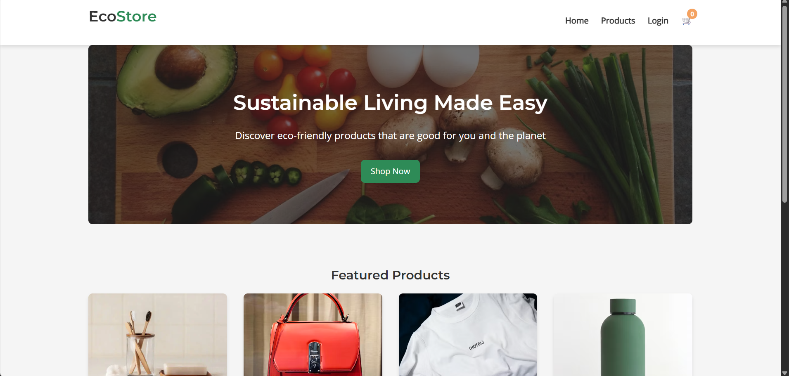
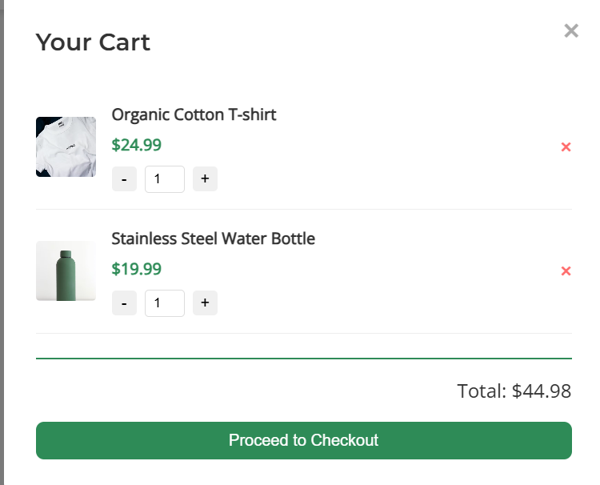
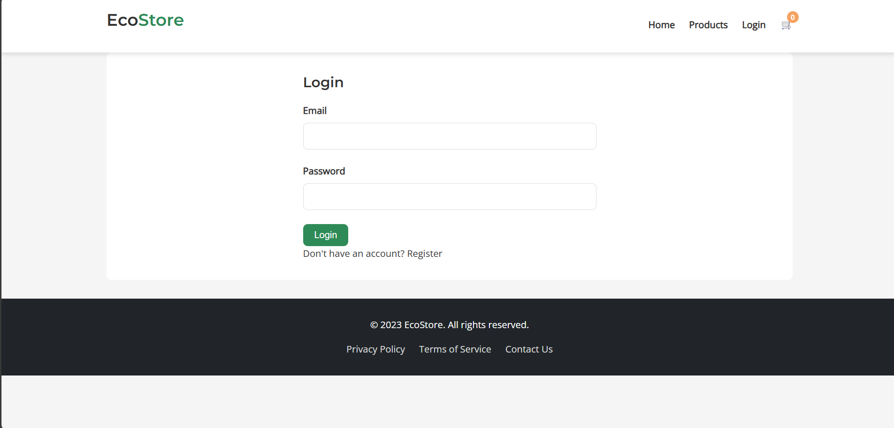
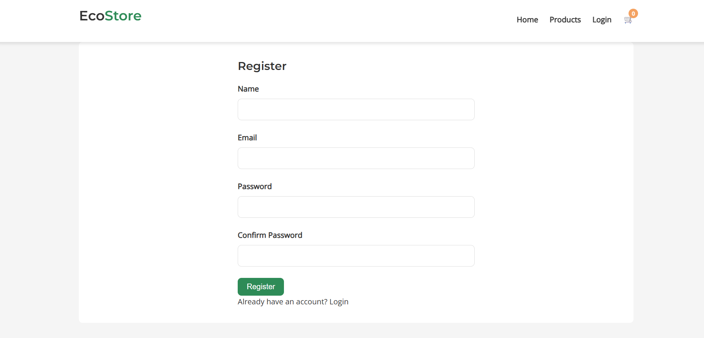
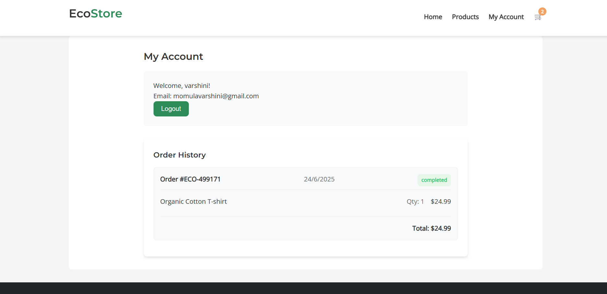

# 🌿 EcoStore – Eco-Friendly E-Commerce Website

EcoStore is a responsive e-commerce web application focused on promoting sustainable living through eco-friendly product offerings. The site is designed with a clean, modern user interface and intuitive features, making it easy for users to browse, filter, and purchase green products online.

---

## 📦 Overview

EcoStore allows users to:
- Explore eco-conscious products across various categories
- Filter by category and price range
- Add products to a dynamic shopping cart
- Register and log in to their personal accounts
- Checkout using a built-in modal form
- View past order history

This project was created using HTML, CSS, and JavaScript for frontend functionality. It's ideal for demonstrating clean UI design, responsive layouts, and basic e-commerce interactivity without backend integration.

---

## ✨ Features

- 🏠 **Home Page**: Includes a hero section and featured product highlights
- 🛍️ **Products Page**:
  - Dynamic filtering by category and price
  - Real-time product search
- 🛒 **Cart System**:
  - Add/remove items
  - Quantity control
  - Modal-based cart view with total calculation
- 👤 **Account System**:
  - Login/Register flow
  - User welcome screen
  - Displays order history (front-end simulation)
- 💳 **Checkout Modal**:
  - Collects shipping and payment details
  - Order confirmation with ID and email feedback
- 📱 **Responsive Design**:
  - Works seamlessly across desktops, tablets, and smartphones

---

## 🛠️ Technologies Used

| Technology     | Purpose                                 |
|----------------|------------------------------------------|
| HTML5          | Structure of the web pages              |
| CSS3           | Styling and responsive layout           |
| JavaScript     | Dynamic UI functionality                |
| Google Fonts   | Typography (Montserrat & Open Sans)     |
| Flexbox/Grid   | Layout and alignment                    |
| Media Queries  | Mobile responsiveness                   |

---

## 📸 Screenshots

### 🔹 Home Page (Hero + Featured Products)

### 🔹 Product Listing with Filters

### 🔹 Shopping Cart Modal

### 🔹 Account Login / Register

### 🔹 Checkout & Order Confirmation

## 🚀 Future Plans

- 🔐 Backend Integration using Node.js and Express
- 🧾 Persistent login and product data via MongoDB or Firebase
- 💰 Payment gateway integration (Razorpay/Stripe)
- 📦 Inventory management and admin dashboard
- 🛍️ Wishlist and product reviews
- 🌎 Multi-language support
- 🕵️ SEO optimization and performance improvements

---

## 📫 Contact
**Varshini Reddy**  
📧 varshinimomula@gmail.com  
🔗 [LinkedIn](https://www.linkedin.com/in/momula-varshini-reddy-400214238)  
🐙 [GitHub](https://github.com/VarshiniReddy05)
---
